# Zyntra

[](https://github.com/zyvorai/zyntra/actions/workflows/ci.yml)
[](LICENSE)
[](CHANGELOG.md)
[](go.mod)
[](web/package.json)

[](https://zyvor.dev/schedule?utm_source=github&utm_medium=zyntra&utm_campaign=readme_hero)
[](https://zyvor.dev/poc?utm_source=github&utm_medium=zyntra&utm_campaign=readme_hero)
[](docs/sales/enterprise-pricing.md)

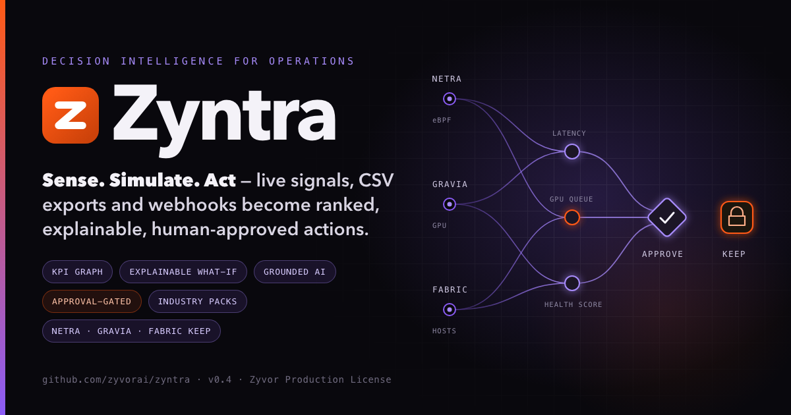

### Stop arguing over dashboards. Know the next best action — and why.

**Decision intelligence for infrastructure ops, and for any business that can export a CSV. Sense, simulate, act — with a human in the loop.**

**Explainable, not generative** · **Approval-gated** · **Dry-run by default** · **Read-only sources** · **Packs are files**

Zyntra keeps a live graph of the KPIs your infrastructure is judged on (SLOs, latency, queue wait, capacity headroom, spend), shows which ones are missing target and by how much, simulates candidate actions through the dependency graph, and ranks them. Every recommendation is explained step by step and waits for human approval. The engine is domain-agnostic: infrastructure is pack zero, and [packs](#packs-any-industry) such as [shop](packs/shop) run the same loop on CSV exports and webhooks.

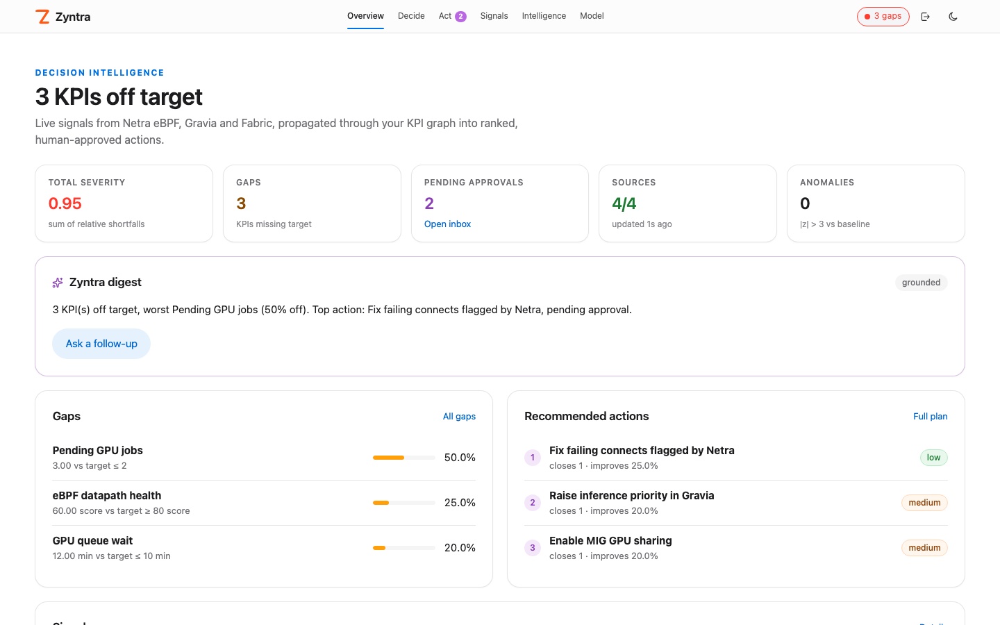

> **Maturity (honest):** v0.3 turned the approval inbox into a decision engine: criticality-weighted scoring, hard constraints, prediction ranges, per-KPI freshness, combined actions, quorum approvals with roles and SSO, re-checks right before execution, outcome verification with linked rollbacks, and signed, hash-chained decision records. v0.4 (in development, Phase A of the [plan](docs/PRODUCT_PLAN.md)) adds packs, file/http/sheet/webhook-in/manual sources, webhook/file/noop actions with preconditions and invariants, owner filters and predicted-versus-actual per KPI. One pack ships so far ([shop](packs/shop)); the GPU lab model has not moved to `packs/gpu` yet. Changes still execute **only after human approval** and in dry-run by default. The simulator is a deterministic model over the edge weights and effects you supply; it does not learn them, and its ranges come from the uncertainty you declare, not from data. Sources only read. The AI layer explains and forecasts; it never picks or runs an action.

## Why Zyntra

Infra teams answer "what should we do next?" with a dozen dashboards and a meeting. Adding nodes shortens the queue but blows the budget. MIG frees GPUs but adds latency. Zyntra makes those trade-offs explicit:

| When this happens… | Zyntra gives you… |
|---|---|
| Five dashboards are red and nobody agrees what matters | **Gaps:** which KPIs miss target, who owns them, and how far off they are |
| "If we add nodes, what happens to latency and spend?" | **What-if:** the predicted change to every KPI, with the full propagation path |
| Three fixes are proposed in the incident channel | **Plan:** all actions ranked by gap closed minus risk, flagging any gap an action would *open* |
| You don't trust an AI to touch production | **No hallucinations:** no LLM makes decisions. Every number traces back to an input, an edge or an action effect, and nothing runs until a named human approves |

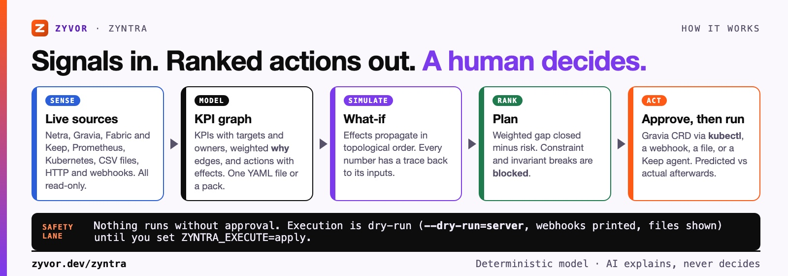

## See it

| | |
|---|---|
| 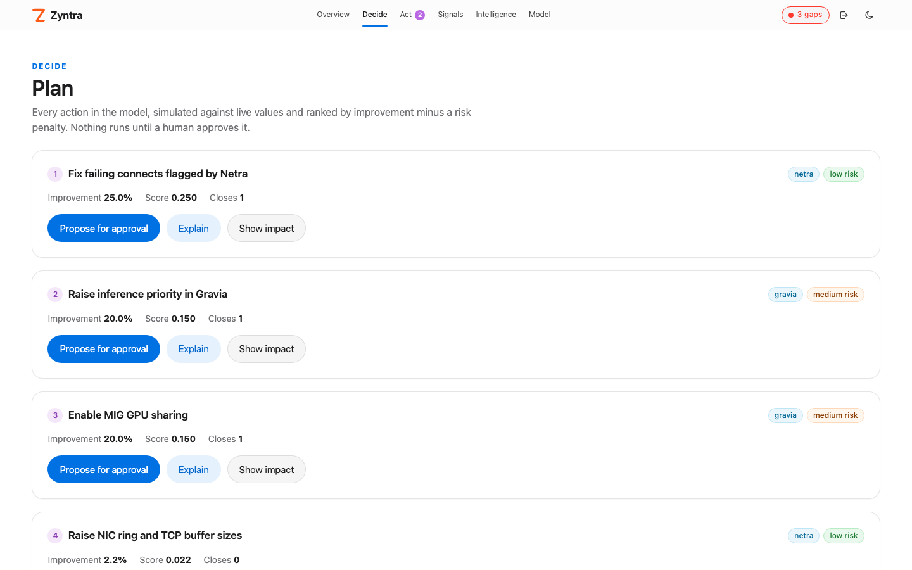 | 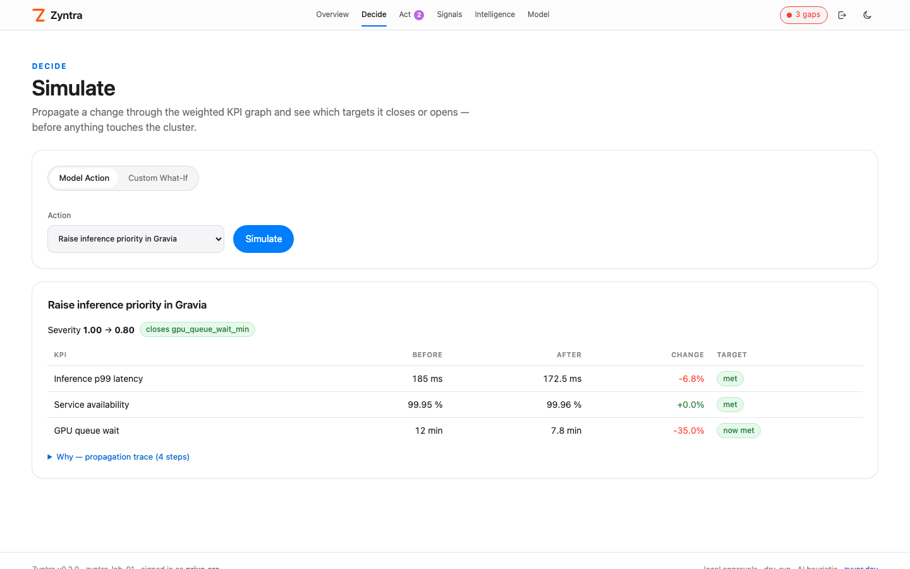 |
| **Plan:** every action ranked; nothing runs until approved | **Simulate:** before/after for each KPI, plus the propagation trace |
| 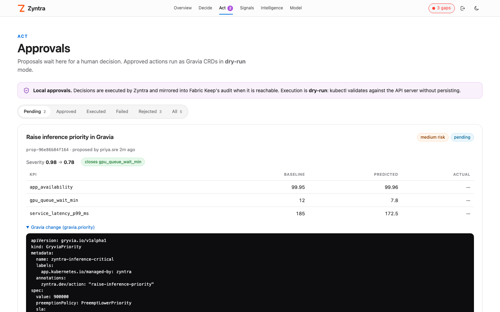 | 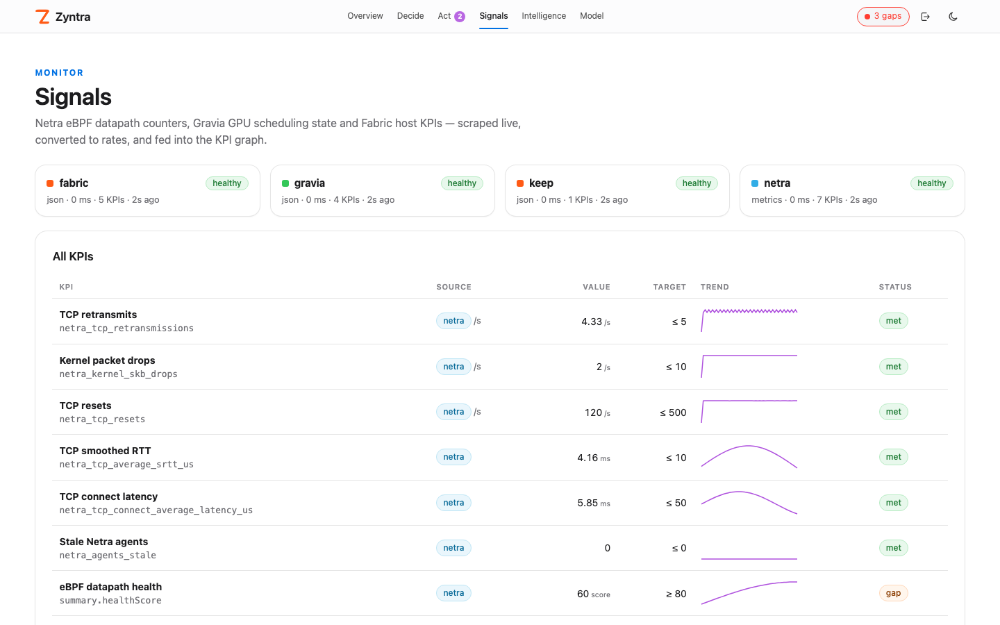 |
| **Approvals:** prediction, baseline and the exact Gravia CRD | **Signals:** live sources with trend and target status |
| 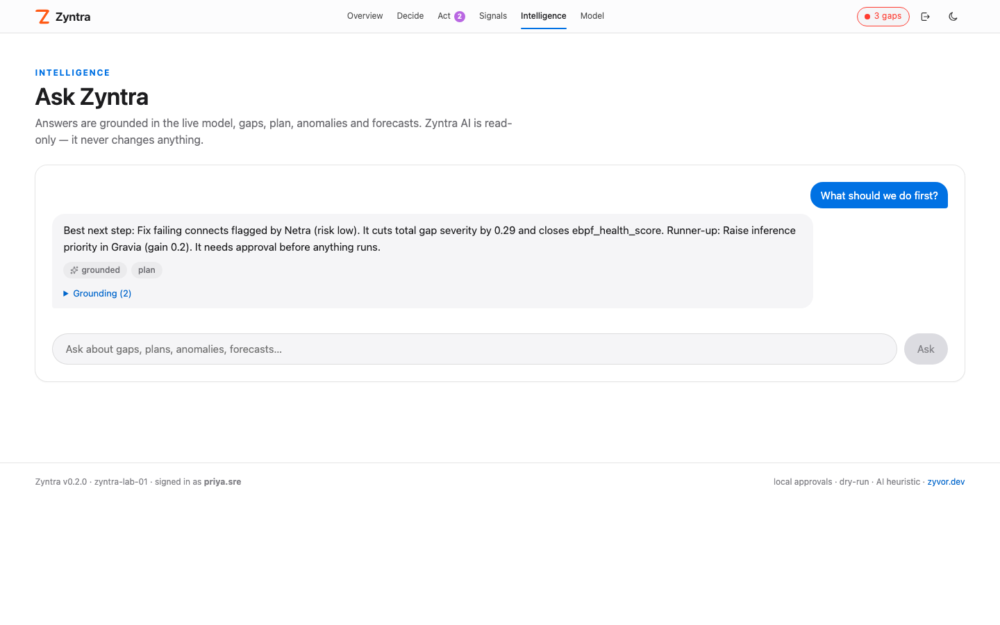 | 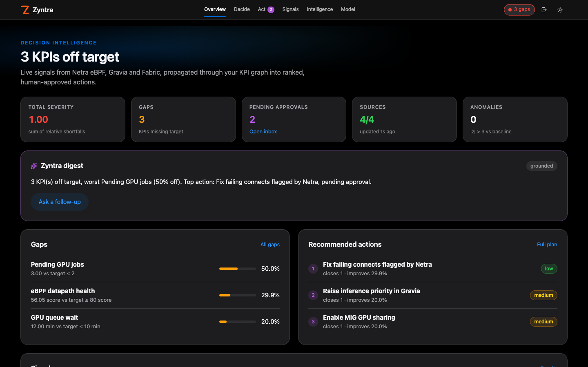 |
| **Ask:** grounded answers that list their facts | **Dark mode**, styled like Netra |

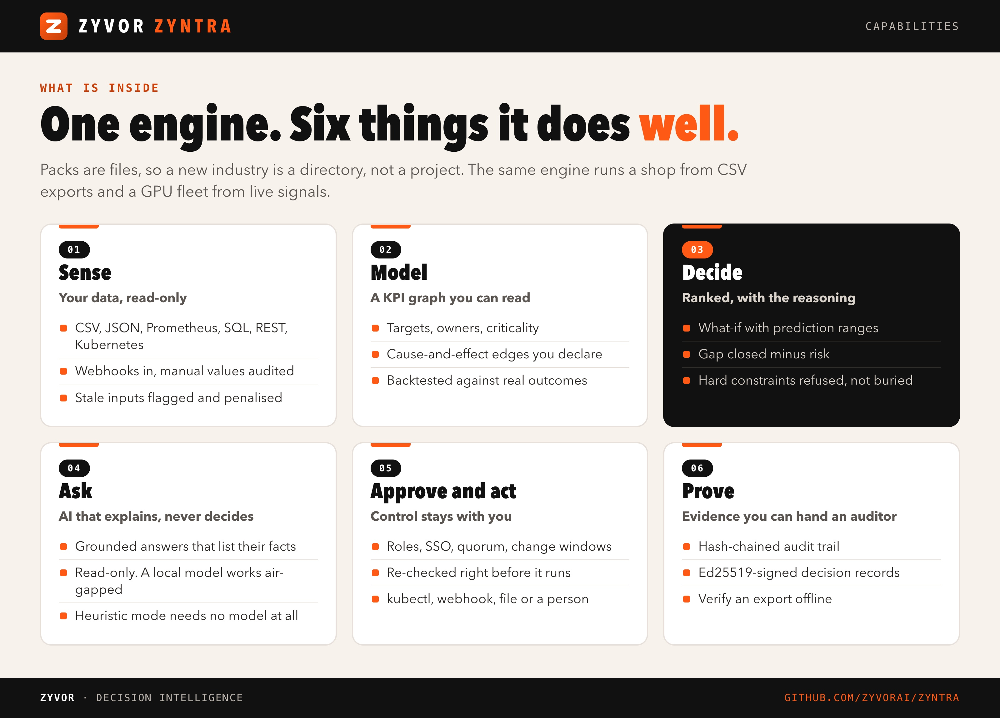

## Quick start

```bash
make build                # console (web/, needs Node 22) + Go binary
./bin/zyntra gaps
./bin/zyntra simulate -action preempt_batch_to_spot
./bin/zyntra plan
ZYNTRA_API_KEY=dev ./bin/zyntra serve   # console + API on :8080
```

Try the lab model against fake Netra/Gravia/Fabric/Keep sources:

```bash
make run-lab              # http://127.0.0.1:8080, operator: any name, access key: dev
```

```text
$ ./bin/zyntra simulate -action preempt_batch_to_spot
What if: Move batch training to spot GPUs (preempt_batch_to_spot)

KPI                    BEFORE  AFTER  CHANGE  TARGET
capacity_headroom      8       14.4   +80.0%  missed
queue_wait_minutes     35      12.6   -64.0%  met (closed)
p99_inference_latency  420     252    -40.0%  met (closed)
slo_availability       99.82   99.92  +0.10%  met (closed)
monthly_cost           180     171    -5.0%   met

Why:
  preempt_batch_to_spot changes capacity_headroom by +80.0% (direct effect)
  preempt_batch_to_spot changes monthly_cost by -5.0% (direct effect)
  capacity_headroom +80.0% -> queue_wait_minutes -64.0% (weight -0.8): free GPUs drain the training queue
  capacity_headroom +80.0% -> p99_inference_latency -40.0% (weight -0.5): inference pods stop competing for saturated GPUs
  p99_inference_latency -40.0% -> slo_availability +0.10% (weight -0.0025): latency spikes trip request timeouts

Gap severity: 2.334 -> 0.280 (-2.054)
Closes: queue_wait_minutes, p99_inference_latency, slo_availability
```

## The model

A model file ([examples/kpis.yaml](examples/kpis.yaml)) has three parts:

```yaml
kpis:
  - {id: capacity_headroom, unit: "%", owner: platform, value: 8, target: 20, direction: higher}
edges:      # +10% in `from` causes weight * 10% in `to`; must be acyclic
  - {from: capacity_headroom, to: queue_wait_minutes, weight: -0.8, why: free GPUs drain the queue}
actions:
  - id: preempt_batch_to_spot
    adapter: zynera
    risk: medium
    effects: [{kpi: capacity_headroom, change: 0.8}]
```

- **Gap severity** is the relative shortfall against target (`0.4` = 40% off), multiplied by the KPI's criticality weight (`critical` 4, `high` 2, `normal` 1, `low` 0.5). The plan minimises the weighted sum.
- **Propagation** runs in topological order with interval arithmetic: every effect and edge carries a low/nominal/high band, so predictions come with a range. Effects are relative (a fraction) or `mode: absolute` (in the KPI's unit, so a KPI at zero can move), can `saturate` and take a `delay`. Results are clamped to `min`/`max`; KPIs without bounds can't drop below zero.
- **Hard constraints** (`constraints:`) set a floor, ceiling or `mustNotWorsen` on a KPI. Critical KPIs with a target are constraints automatically. An action that would breach one, even at the pessimistic end of its band, is listed as blocked instead of ranked.
- **Score** = weighted gap reduction − risk penalty (low 0, medium 0.05, high 0.15) − 0.25 × uncertainty − 0.1 per stale input. Zyntra also tries pairs of actions that touch different KPIs and keeps a pair only if it beats both actions alone. Each recommendation has a confidence (high, medium, low).

### Model reference (v0.3)

```yaml
kpis:
  - id: app_availability
    value: 99.95
    target: 99.9
    direction: higher
    criticality: critical         # weights severity; critical + target = hard floor
    min: 0
    max: 100                      # results are clamped to bounds
    freshness: {maxAge: 1m, required: true}   # required: block execution when stale
constraints:
  - {kpi: host_memory_percent, ceiling: 90, why: OOM above 90%}
  - {kpi: gravia_available_gpus, mustNotWorsen: true}
edges:
  - {from: queue, to: latency, weight: 0.05, confidence: 0.6, provenance: learned, delay: 5m}
actions:
  - id: raise-inference-priority
    effects:
      - {kpi: gpu_queue_wait_min, change: -0.35, uncertainty: 0.3, delay: 5m}
      - {kpi: gpu_utilization, change: 10, mode: absolute, saturation: 30}
    execute: {template: gravia.priority, params: {name: inference-critical, value: "900000"}}
    rollback: {template: gravia.priority-delete, params: {name: inference-critical}}  # optional; derived for Gravia templates
    outcome:                       # how to judge the action after it runs
      window: 20m
      samples: 3                   # consecutive fresh samples that must pass
      successCriteria: [{kpi: gpu_queue_wait_min, op: met}]   # met | < | <= | > | >= with value
      guardrails: [app_availability]
      tolerance: 0.05
    policy: {approvals: 2, keep: required, requireFresh: true, maintenanceWindows: [weeknights]}
```

Edge `confidence` below 1 widens the band; `provenance: learned` marks the relationship as assumed in the trace. A KPI's freshness defaults to three refresh intervals; values older than that are `stale`, never-fetched ones `missing`, and KPIs without a source `static`.

### Live values

Add a `source` to any KPI and pass the adapter flags:

```yaml
- id: p99_inference_latency
  value: 420            # fallback
  target: 300
  direction: lower
  source:
    kind: prometheus
    query: 1000 * histogram_quantile(0.99, sum(rate(http_request_duration_seconds_bucket{job="inference"}[5m])) by (le))
- id: gpu_nodes
  value: 8
  source: {kind: kubernetes, metric: nodes_ready}   # nodes_total | nodes_ready | gpu_allocatable | cpu_allocatable
```

```bash
zyntra gaps -f examples/prometheus-kpis.yaml -prometheus http://prometheus:9090 -kubectl
```

### Live sources (Netra, Gravia, Fabric, Keep)

`kind: metrics` scrapes Prometheus text (Netra's `/metrics`). `kind: json` reads a field from a JSON endpoint; `kind: netra`, `gravia`, `fabric` and `keep` are shorthands that also pick the endpoint. Zyntra ships no eBPF code of its own; it consumes the Netra agent.

```yaml
- id: tcp_retransmits_per_s
  source: {kind: metrics, endpoint: netra, metric: netra_tcp_retransmissions, agg: sum, rate: true}
- id: ebpf_health_score
  source: {kind: netra, path: /api/v1/ebpf/health, field: summary.healthScore}
- id: root_disk_percent
  source: {kind: fabric, path: /api/v1/system/info, field: "filesystems.#(mountpoint=/).usage_percent"}
```

Fields support `a.b.0`, `list.#` (count), `list.#(k=v)` (count matches), `list.#(k=v).f` (field of the first match) and `list.*.f`, plus `scale`, `agg: sum|avg|max|min` and `rate`. See [examples/lab-kpis.yaml](examples/lab-kpis.yaml) for a full lab model (20 KPIs) that uses every v0.3 field.

## Packs (any industry)

The engine knows nothing about GPUs or shops. A **pack** is a directory of files: `pack.yaml` (id, owners, timezone, calendars), `kpis.yaml`, `sources.example.yaml`, a README and a `fixture/` of sample exports. [packs/shop](packs/shop) runs a shop from CSV exports with no Kubernetes in the loop:

```bash
zyntra pack list
zyntra pack validate packs/shop
zyntra plan -f packs/shop                                   # ranks a reorder, refuses a markdown that breaks the margin invariant
zyntra simulate -f packs/shop -action reorder_fast_movers   # prints the dry-run purchase order
zyntra gaps -f packs/shop -owner floor
```

**Generic sources.** `file` (CSV, JSON, YAML or Prometheus text, reloaded on change), `http` and `sheet` (the same over HTTP), `webhook-in` (a gateway POSTs JSON to `/api/v1/ingest/<channel>` with `ZYNTRA_INGEST_TOKEN`) and `manual` (entered in the console, audited). Rows can be filtered, aggregated and divided:

```yaml
- id: stockout_rate               # share of SKUs with nothing on hand
  unitClass: ratio
  source: {kind: file, file: fixture/stock.csv, field: "#(on_hand=0)", denominator: "#"}
- id: daily_sales
  currency: INR
  calendar: shop-hours            # outside the window the last in-window value is held
  source: {kind: file, file: fixture/pos.csv, field: "*.amount"}   # summed
- id: erp_open_pos
  source: {kind: http, url: "${ZYNTRA_ERP_URL}/po?status=open", headers: {Authorization: "Bearer ${ZYNTRA_ERP_TOKEN}"}, field: "#"}
```

Every source reports `ok`, `stale`, `error` or `fallback`. Only `${ZYNTRA_*}` variables are expanded, and they stay unexpanded in rendered proposals.

**Generic actions.** Besides kubectl and Keep, an action can be a `webhook` (dry-run prints method, URL, headers and body; apply sends it with an `Idempotency-Key` and records the status and response hash), a `file` (written under `ZYNTRA_OUTPUT_DIR`, never overwritten) or `noop` (people do it; the approval is recorded). Actions can also declare:

```yaml
  window: buy-hours                                  # approved runs wait for the window
  approvers: 2                                       # two-person
  preconditions: [{kpi: stockout_rate, worse_than: 0.02}]   # fail closed: shown, scored, not approvable
  invariants: [{kpi: gross_margin, max_worsen: 0.03}]       # a simulated break blocks the action
  compensate: cancel_open_po                         # linked on the proposal as the undo; never auto-run
```

After an apply, the decision record compares predicted and actual per KPI and marks each a hit or a miss. See [docs/PRODUCT_PLAN.md](docs/PRODUCT_PLAN.md) for the pack catalog and build order.

## Console

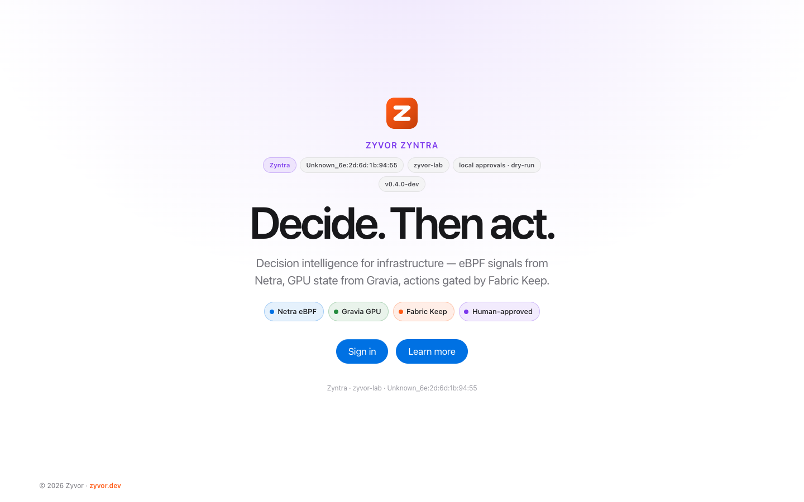

`zyntra serve` embeds a React console styled like Netra. Its pages are Overview, Gaps, Plan, Simulate, Approvals, Audit, Signals, Insights, Ask and Model, plus a timeline page for each decision, with light and dark themes.

Sign in with **SSO** (OpenID Connect, authorization code with PKCE), a **local account** from the policy file (bcrypt), or the **access key** (`ZYNTRA_API_KEY`, kept as break-glass admin access). Sign-in sets an HMAC session cookie carrying your name and roles (12 h, or 7 days with "remember me"). Scripts can use `Authorization: Bearer $ZYNTRA_API_KEY`.

| Role | Can |
|------|-----|
| `viewer` | Read models, plans, simulations, proposals, decisions and audit |
| `proposer` | Also create proposals |
| `approver` | Also propose, approve and reject |
| `executor` | Read, and run approved proposals through the exec endpoint |
| `admin` | Everything (the access key signs in as admin) |

With OIDC, `ZYNTRA_OIDC_ROLE_MAP` maps identity-provider groups to roles, for example `sre-leads=approver,platform=proposer,oncall=executor+viewer`. Users whose groups map to nothing are refused unless `ZYNTRA_OIDC_DEFAULT_ROLE` is set.

## AI (grounded, read-only)

- **Anomalies:** z-score of each KPI against its own history.
- **Forecasts:** least-squares trend with time to breach. A forecast needs at least 6 samples spanning 10 minutes.
- **Digest, Ask and Explain:** built from gaps, plan, anomalies and source health, with the grounding facts listed. Set `ZYNTRA_AI_BASE_URL` (an OpenAI-compatible endpoint such as the Fabric AI gateway) and the model rewrites the grounded answer. Without it, the heuristic answer is returned.

## Approvals and execution

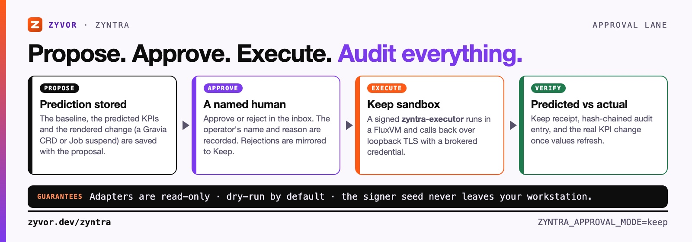

1. **Propose** an action (or a pair) from the plan. Zyntra captures a decision record: the input values with their freshness and source health, the model version, the full simulation with bands, the alternatives it considered, the effective policy, and the change it would make (a `GryviaPriority`, `GryviaGPUSharingPolicy` or Job suspend). Proposals that would breach a hard constraint are refused.
2. **Approve** or reject it. The policy decides how many distinct approvers are needed and whether the proposer may be one of them. Pending proposals expire (24 h by default) and approvals hold for a limited time (1 h by default).
3. **Revalidate.** Right before running, Zyntra takes a fresh snapshot and re-simulates. It blocks execution, and records why, if a required input is stale, a constraint would now be breached, the predicted improvement has fallen by more than `maxDrift` (50% by default), the model changed, the approval expired, or it is outside the action's maintenance window. Approvals outside their window wait and run when it opens.
4. **Execute:** `kubectl apply --dry-run=server` by default (`ZYNTRA_EXECUTE=apply` to apply for real).
5. **Observe.** After a real apply Zyntra watches the outcome: `verified` when the success criteria hold for enough consecutive fresh samples, `regressed` when a guardrail KPI worsens past its tolerance or a constraint breaks, `missed` when the window ends without success, `inconclusive` when the data was stale. A regression opens a linked **rollback proposal** that goes through the same approval policy (Gravia priority and MIG policies are deleted, suspended jobs resumed).

Every transition is appended to a hash-chained audit log (`GET /api/v1/audit/verify` checks it). `GET /api/v1/decisions/{id}/export` returns the decision and its audit events signed with Ed25519 (the key lives in `$ZYNTRA_STATE_DIR/decision-signing.key`); `zyntra verify-decision FILE` checks an export offline. State from v0.2 is migrated on first start.

### Policy

`zyntra serve -policy policy.yaml` (or `ZYNTRA_POLICY`) sets approval rules; see [examples/policy.yaml](examples/policy.yaml). Without a file, one approval is enough, as in v0.2.

```yaml
maintenanceWindows:
  weeknights: {days: [mon, tue, wed, thu, fri], start: "22:00", end: "06:00", timezone: Europe/Berlin}
rules:
  - name: high-risk-two-person
    match: {risk: [high]}          # also: actions, adapters
    approvals: 2
    distinctFromProposer: true
    maintenanceWindows: [weeknights]
    approvedExpiry: 12h
  - name: gravia-through-keep
    match: {adapters: [gravia]}
    keep: required                 # required | preferred (default) | off
    requireFresh: true
revalidation: {maxDrift: 0.5}
users:                             # optional local accounts
  - {name: ana, passwordHash: "$2a$12$...", roles: [approver]}
```

Later rules override earlier ones, an action's own `policy:` block overrides both, and for a pair the strictest setting of each kind wins. With `keep: required`, Zyntra blocks the proposal instead of falling back to local execution when Keep is unavailable.

With `ZYNTRA_APPROVAL_MODE=keep`, approved proposals run through **Fabric Keep**:

1. Keep starts a signed `zyntra-executor` agent in a FluxVM sandbox.
2. The agent calls Zyntra's loopback TLS exec endpoint using the brokered `zyntra-exec` credential. Keep holds the egress approval, and Zyntra decides it, so every execution has a Keep receipt and a hash-chained audit entry.
3. Rejected proposals are mirrored into Keep's audit as denied approvals.

If Keep can't start the session before an approval exists, the already-approved proposal runs locally (unless policy says `keep: required`), and the audit records the executor as `zyntra (keep unavailable)`.

```bash
zyntra keep pubkey                       # signer public key (add it to ZYVOR_AGENT_POLICY_TRUSTED_SIGNERS)
ZYNTRA_KEEP_TOKEN=... zyntra keep deploy -url http://127.0.0.1:9096   # sign + deploy; the seed never leaves this machine
zyntra keep credential                   # zyntra-exec descriptor for ZYVOR_AGENT_CREDENTIALS_FILE
```

## Configuration

| Variable | Purpose |
|----------|---------|
| `ZYNTRA_API_KEY` | Break-glass admin access key and Bearer token. With no key, OIDC or local users, the console runs open (dev) |
| `ZYNTRA_POLICY` | Policy file (same as `serve -policy`) |
| `ZYNTRA_SESSION_SECRET` | Key for session cookies (defaults to the access key; set it so sign-ins survive key rotation and restarts) |
| `ZYNTRA_OIDC_ISSUER`, `_CLIENT_ID`, `_CLIENT_SECRET` | OpenID Connect sign-in |
| `ZYNTRA_OIDC_ROLE_MAP` | `group=role[+role],…` mapping from IdP groups to Zyntra roles |
| `ZYNTRA_OIDC_REDIRECT_URL`, `_GROUPS_CLAIM`, `_SCOPES`, `_DEFAULT_ROLE` | Optional: callback URL (default derived from the request), groups claim (`groups`), scopes, role for unmapped users |
| `ZYNTRA_LISTEN`, `ZYNTRA_STATE_DIR` | Listen address; directory for decisions, history, the decision signing key and exec TLS |
| `ZYNTRA_NETRA_URL` / `_TOKEN` | Netra API (eBPF metrics and health) |
| `ZYNTRA_GRAVIA_URL` / `_TOKEN` | Gravia API (GPU cluster, quota, costs) |
| `ZYNTRA_FABRIC_URL` / `_USER` / `_PASSWORD` or `_TOKEN` | Fabric host metrics (logs in for a token) |
| `ZYNTRA_ENDPOINT_INSECURE=1` | Accept self-signed certificates on the endpoints above (lab) |
| `ZYNTRA_EXECUTE` | `dry-run` (default) or `apply` |
| `ZYNTRA_OUTPUT_DIR` | Where `file` actions write (default `$ZYNTRA_STATE_DIR/out`) |
| `ZYNTRA_INGEST_TOKEN` | Token that may only POST to `/api/v1/ingest/<channel>` |
| `ZYNTRA_KUBECONFIG` | kubeconfig for execution and the `-kubectl` adapter |
| `ZYNTRA_APPROVAL_MODE` | `local` (default) or `keep` |
| `ZYNTRA_KEEP_URL` / `_TOKEN` | Keep agent runtime (status, sessions, approvals, audit) |
| `ZYNTRA_EXEC_TOKEN`, `ZYNTRA_EXEC_TLS_ADDR` | Token Keep injects, and the loopback TLS listener it calls |
| `ZYNTRA_AI_BASE_URL` / `_API_KEY` / `_MODEL` | Optional OpenAI-compatible model for answer rewriting |

## CLI

| Command | What it does |
|---------|--------------|
| `zyntra graph` | KPIs, targets, owners, sources, dependencies and actions |
| `zyntra gaps [-owner NAME]` | KPIs missing target, worst first |
| `zyntra simulate -action ID[+ID]` | Predicted KPI changes with ranges, constraint breaches and the propagation trace |
| `zyntra plan [-owner NAME]` | Actions and pairs ranked with confidence, then those waiting on a precondition and those blocked by constraints or invariants |
| `zyntra pack list\|validate [DIR]` | List packs under `packs/`, or check one against its fixture |
| `zyntra serve [-policy FILE]` | Console, REST API and SSE pulse |
| `zyntra verify-decision FILE` | Check a signed decision export offline |
| `zyntra hash-password < pw` | bcrypt hash for a local account in the policy file |
| `zyntra keep deploy\|pubkey\|credential` | Fabric Keep executor agent |
| `zyntra fake-sources` | Fake Netra/Gravia/Fabric/Keep endpoints for development |
| `zyntra exec-token` | Random token for `ZYNTRA_EXEC_TOKEN` |

Common flags: `-f FILE|PACK_DIR`, `-o text|json`, `-prometheus URL`, `-kubectl`, `-kubeconfig FILE`. `serve` also takes `-addr`, `-interval` and `-policy`.

## API

All routes except `/healthz`, `/api/v1/meta`, sign-in and the OIDC redirects need a session cookie or a Bearer key. The role column is the minimum role.

| Method | Path | Role | Returns |
|--------|------|------|---------|
| `GET` | `/healthz` | — | `{"status":"ok"}` |
| `GET` | `/api/v1/meta` | — | Version, host, model, source health, modes and sign-in methods |
| `POST`/`DELETE` | `/api/v1/session` | — | Sign in (`{operator, token}` or `{username, password}`) and out; `GET /api/v1/whoami` returns subject and roles |
| `GET` | `/api/v1/auth/oidc/login`, `/callback` | — | OIDC sign-in redirects (when configured) |
| `GET` | `/api/v1/graph`, `/gaps`, `/plan`, `/sources`, `/freshness`, `/policy` | viewer | Model with version and constraints, gaps, ranked and blocked actions, source health, per-KPI freshness, effective policy. `/gaps` and `/plan` take `?owner=` |
| `POST` | `/api/v1/simulate` | viewer | `{"action":"a"}`, `{"action":"a+b"}`, `{"actions":[…]}` or `{"custom":{...}}` |
| `GET` | `/api/v1/kpis/{id}/history` | viewer | Recorded values |
| `POST` | `/api/v1/kpis/{id}/value` | proposer | Enter a value for a `manual` KPI (`{"value":2,"reason":"..."}`), audited |
| `GET` | `/api/v1/inputs` | viewer | Manual KPIs and webhook-in channels with their last entry |
| `POST` | `/api/v1/ingest/{channel}` | ingest | JSON document for a `webhook-in` channel (ingest token or admin) |
| `GET`/`POST` | `/api/v1/ai/status`, `/digest`, `/insights`, `/ask`, `/explain` | viewer | Grounded AI |
| `GET` | `/api/v1/proposals`, `/proposals/{id}` | viewer | Approval inbox |
| `POST` | `/api/v1/proposals` | proposer | Propose `{"action":"a"}` or `{"actions":["a","b"]}` |
| `POST` | `/api/v1/proposals/{id}/approve`, `/reject` | approver | Record an approval (202 until the quorum is met) or reject |
| `POST` | `/api/v1/exec/{id}` | executor | Revalidate and run an approved proposal (Keep's broker uses the exec token) |
| `GET` | `/api/v1/decisions`, `/decisions/{id}`, `/decisions/{id}/export` | viewer | Decision records, one with its audit events, signed export |
| `GET` | `/api/v1/audit`, `/audit/verify` | viewer | Hash-chained audit trail and its verification |
| `GET` | `/api/v1/keep/status`, `/approvals`, `/receipts`, `/audit` | viewer | Fabric Keep views (`POST /keep/approvals/{id}` needs approver) |
| `GET` | `/api/v1/events` | viewer | Server-sent `pulse` events every interval |

## Deploy

```bash
./scripts/deploy-remote.sh 212.8.248.187 sus     # build, install, configure Keep, deploy agent, smoke
./scripts/smoke-remote.sh                         # re-run the smoke test against .deploy-last
./scripts/deploy-remote.sh 212.8.248.187 sus --uninstall
```

The deploy script cross-compiles locally and installs `zyntra.service` serving the lab GPU model (`examples/lab-kpis.yaml`) with live Netra, Gravia, Fabric and Keep sources. It writes `/etc/zyntra/zyntra.env` (root:zyntra, 0640) from credentials already on the host: the Netra k8s secret, the Gravia API key, Fabric's admin password and the Keep token. They are never printed. It also adds the `zyntra-exec` credential and exec CA to Keep (after backing up Keep's env file) and signs the executor agent on your workstation. Options: `--port`, `--exec-port`, `--no-keep`, `--skip-web`, `--dry-run`, `--skip-smoke`.

The script does not copy `packs/` yet. To run a pack on a host, copy its directory and point `-f` at it, for example `zyntra serve -f /opt/zyntra/packs/shop` with `ZYNTRA_OUTPUT_DIR` for file actions and `ZYNTRA_INGEST_TOKEN` if the pack has webhook-in sources.

On the lab host, Keep sandboxes cannot reach the egress broker, so approved actions run locally and the audit records the executor as `zyntra (keep unavailable)`. The smoke test shows this line on purpose; set `keep: required` in the policy to block instead.

## Where it fits in Zyvor

- **Netra:** eBPF network signals (retransmits, drops, latency, datapath health)
- **Gravia:** GPU utilisation, queue and cost; executes priority, MIG-sharing and job-suspend CRDs
- **Fabric:** host metrics, the AI gateway, and Keep for sandboxed, audited execution
- **Kairo / KubeFlight:** deploy blast radius, to be fed in as a risk input

Outside Zyvor, a pack needs nothing but files: generic sources read exports and APIs, and webhook or file actions hand the approved change to the system that already owns it (ERP, POS, ticketing).

## Develop

```bash
make check      # gofmt, vet, unit tests, build
make test-e2e   # CLI + API + console smoke test against fake sources
zyntra pack validate packs/shop   # check a pack against its fixture
cd web && ZYNTRA_DEV_API=http://127.0.0.1:8080 npm run dev   # console with hot reload
docker build -t zyntra .
```

See [SECURITY.md](SECURITY.md) and [CONTRIBUTING.md](CONTRIBUTING.md). Social and README images are rebuilt from HTML; see [docs/social](docs/social/README.md).

## Editions and pricing

Every capability in this repository stays in **Community**, which is free for non-production use. Production use needs a commercial license. Subscriptions are priced by **managed clusters and KPI graphs**, with unlimited users and approvers.

| Edition | Annual price | Capacity | Support |
|---|---|---|---|
| Community | Free (non-production) | Unlimited non-production clusters | Community |
| Enterprise Essentials | INR 9 lakh / USD 11k | 2 clusters · 5 KPI graphs | 8×5, next business day |
| **Enterprise** | **INR 24 lakh / USD 29k** | **10 clusters · 25 KPI graphs** | **24×7, P1 in 1 hour** |
| Enterprise Scale | INR 48 lakh / USD 58k | 40 clusters · 100 KPI graphs | 24×7, P1 in 30 min + TAM |
| Sovereign / MSP | INR 1 crore / USD 120k+ | Custom | Mission-critical |

Enterprise adds multi-cluster decisions, OIDC/SAML and RBAC, approval policy (change windows, two-person rule, risk-bounded auto-approve), durable decision history, learned edge weights, managed connectors, and certified delivery. A 90-day paid pilot (INR 4–8 lakh) is credited to year one.

[Full pricing sheets](docs/sales/enterprise-pricing.md) · [Pricing PDF](docs/sales/Zyvor-Zyntra-Enterprise-Pricing.pdf) · [Buyer resources](docs/sales/README.md)

## License

Licensed under the **[Zyvor Production License v1.0](LICENSE)**.

- **Free** for development, testing, evaluation, research, education, and non-production labs
- **Paid commercial license required** for production, customer workloads, SaaS, managed services, OEM, redistribution, and other revenue-generating use

Commercial terms are issued separately: [https://zyvor.dev](https://zyvor.dev?utm_source=github&utm_medium=zyntra&utm_campaign=readme_footer).

**Next step:** [Book a demo](https://zyvor.dev/schedule?utm_source=github&utm_medium=zyntra&utm_campaign=readme_footer) · [30-day PoC](https://zyvor.dev/poc?utm_source=github&utm_medium=zyntra&utm_campaign=readme_footer) · [sales@zyvor.dev](mailto:sales@zyvor.dev)
