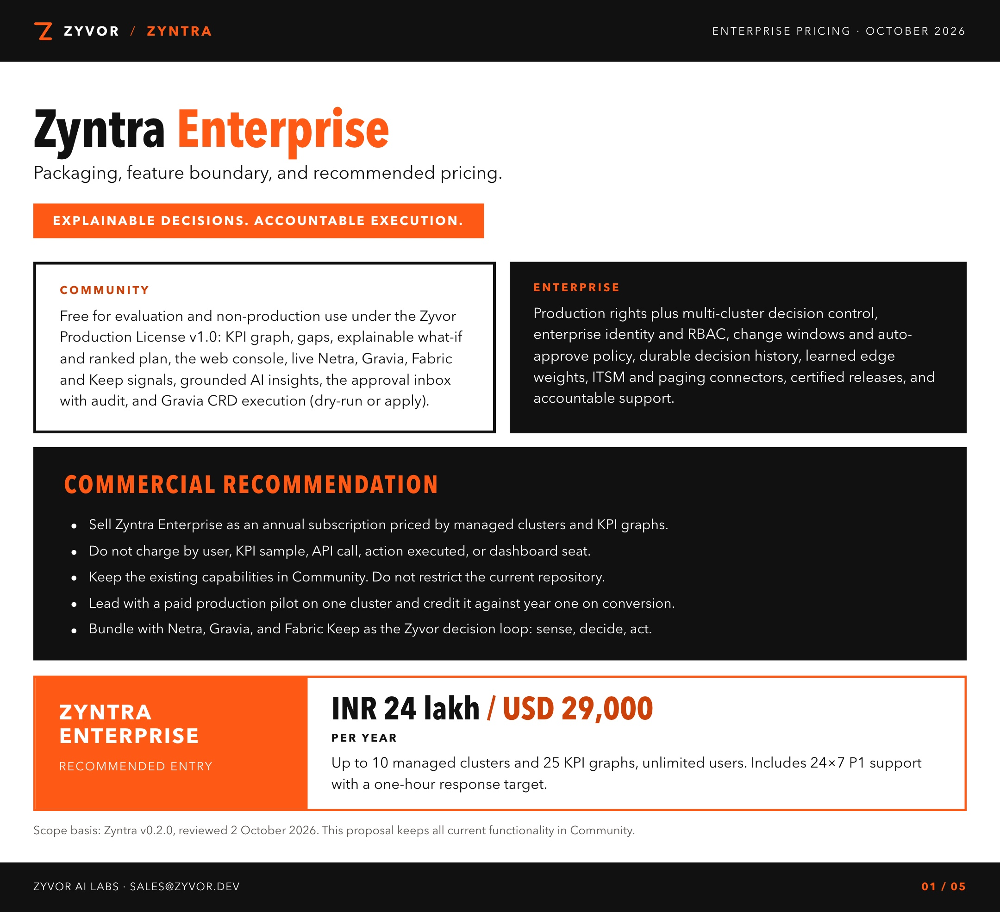
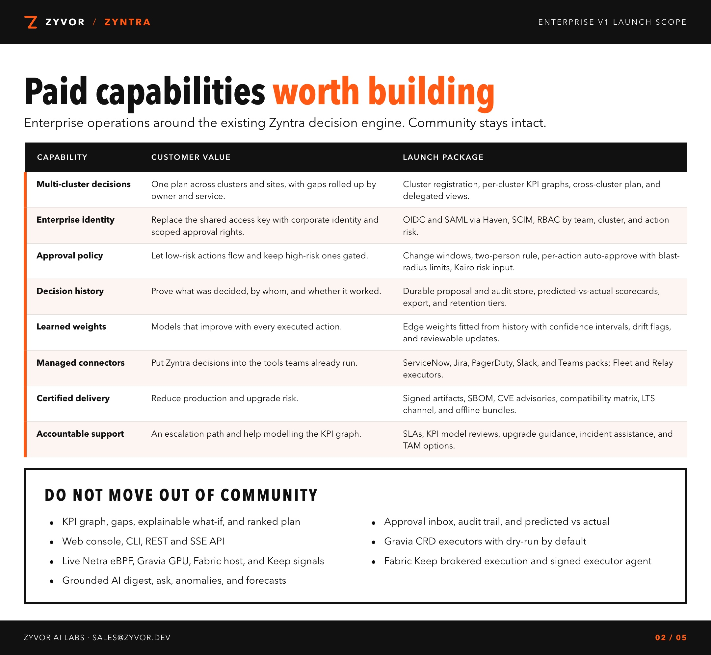
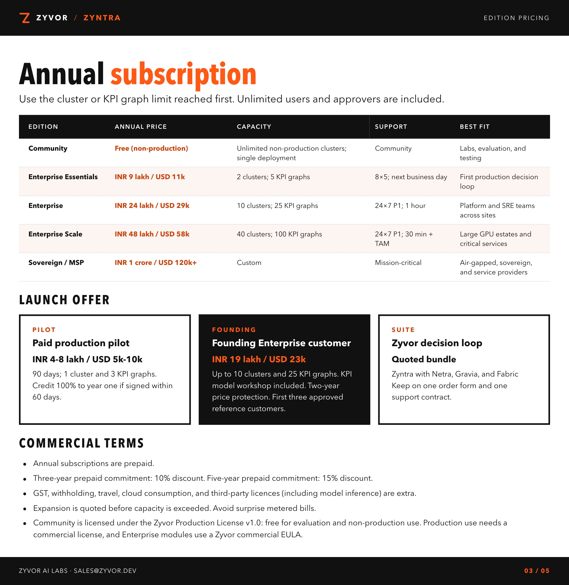
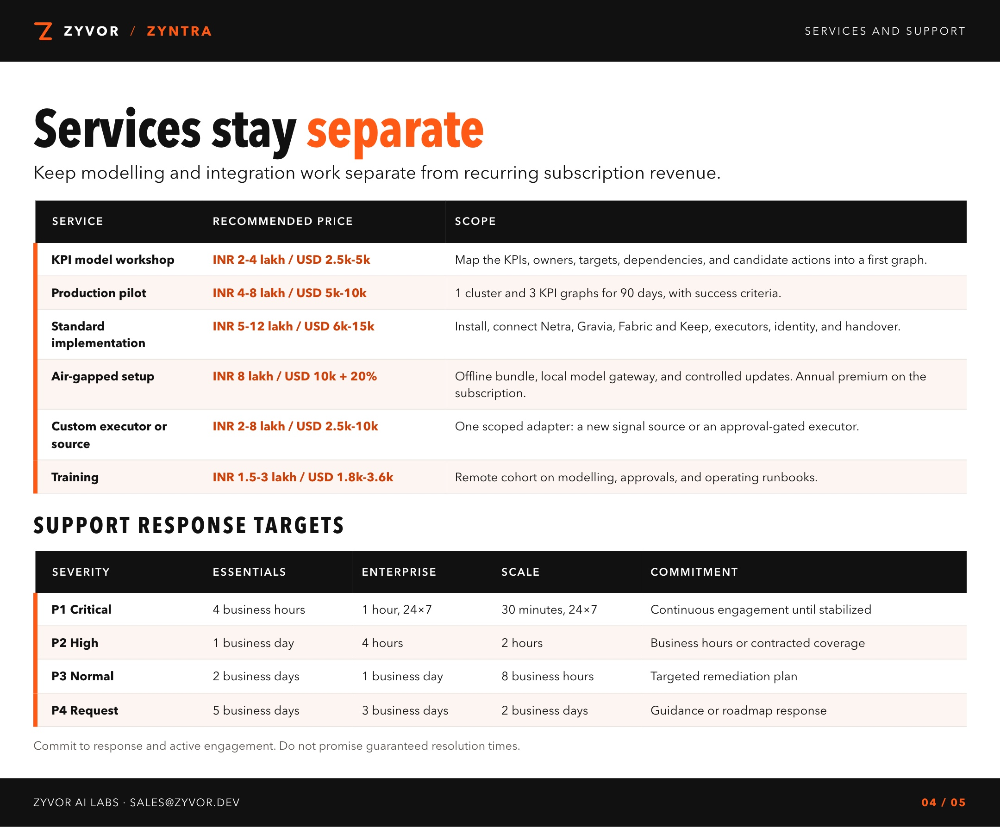
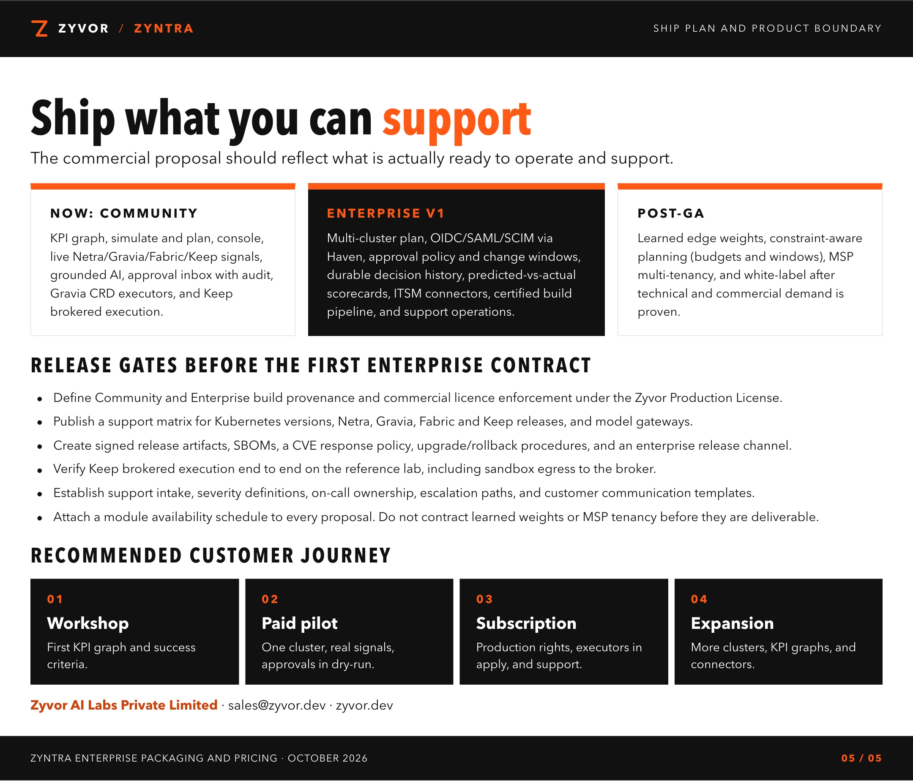

# Zyntra Enterprise pricing

Packaging, feature boundary, and recommended pricing. October 2026.

Non-production use is free under the Zyvor Production License. Production use requires a commercial license. Enterprise subscriptions are priced by managed clusters and KPI graphs, not by user, KPI sample, API call, action, or seat.

[Download the PDF](./Zyvor-Zyntra-Enterprise-Pricing.pdf).

Scope basis: Zyntra v0.2.0, reviewed 2 October 2026. Rebuild the sheets and the PDF with `./docs/sales/enterprise-pricing/build.sh`.

Zyvor AI Labs Private Limited · [sales@zyvor.dev](mailto:sales@zyvor.dev) · [zyvor.dev](https://zyvor.dev)
